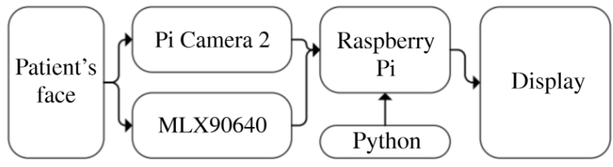
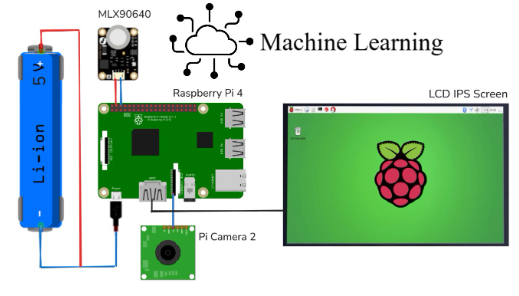
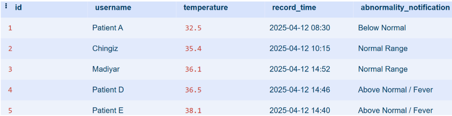
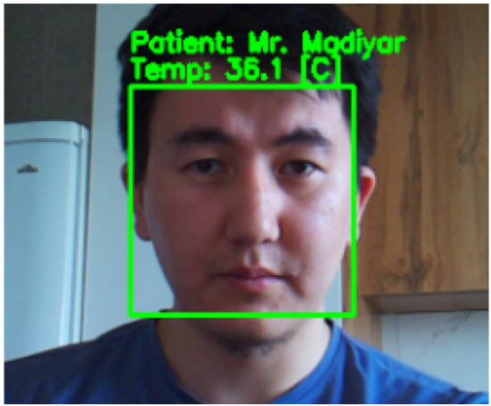
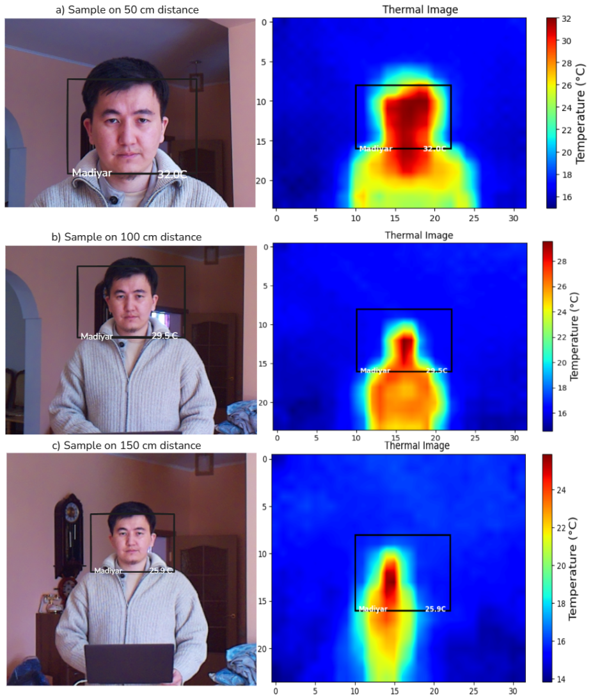
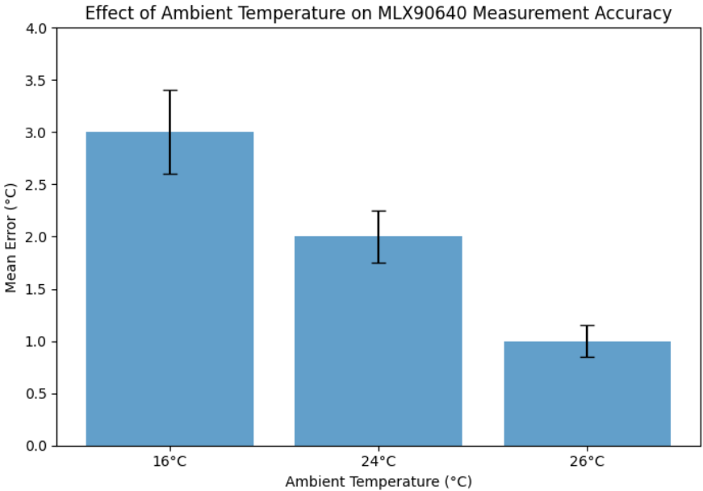

# An Intelligent System for Automated Monitoring and Control of Patient Conditions

**One-liner.** Real-time **IR–RGB fusion** for contactless temperature screening with **face identification**, on-device logging (**SQLite**), alerts, and compact 3D-printed enclosure. *(Springer publication: **in press, 2025**).*

## Highlights
- Parallel capture: **MLX90640 (IR)** + **Pi Camera 2 (RGB)** → aligned ROI → estimation & thresholds.
- **Face ID** module for per-patient tracking; local logs, CSV export.
- Runs on **Raspberry Pi 4**, total HW cost **< $130** (BOM pending).

Minimal on-device pipeline. Pi Camera 2 and MLX90640 watch the patient’s face in parallel and stream into a Raspberry Pi 4. We timestamp and sync frames. 
All while logging {username, temperature_c, record_time, abnormality_notification} to SQLite for later poking around. Runs fully on-device (no cloud, no drama) for privacy and low latency.

<p align="center">
  
</p>
<p align="center">
  <a href="docs/figs/fig1_system_architecture.png">Open full-size figure →</a>
</p>

## Installation

We keep dependencies **strictly** to what the two demo scripts import.

```bash
# Python deps used only by the two demos
pip install -r requirements.txt

# System package required by the OpenCV demo
sudo apt update && sudo apt install -y python3-picamera2
```
## Demo

## 1) IR-only heatmap viewer (Matplotlib)
python examples/matplotlib_thermal_viewer.py

## 2) IR+RGB overlay with blend trackbar (OpenCV)
python examples/opencv_thermal_overlay.py 

## Hardware

**Physical hardware layout (RPi 4 + MLX90640 + Pi Camera 2 + HDMI IPS).** A **Raspberry Pi 4** provides on-device compute and I/O. The **Pi Camera 2** connects for the RGB stream, the **MLX90640** thermal array is attached on **I²C** (SDA=GPIO2, SCL=GPIO3) and powered at **3.3 V** (do not apply 5 V to the sensor). 

The annotated video is rendered to an **IPS LCD** over HDMI. 

The system is supplied from a regulated **5 V** Li-ion source (≈5–7 W under load) with a single common ground. 

All processing runs locally, however cloud computing is used when AI is needed to improve the quality of thermal images.

Physical hardware layout (RPi4 + MLX90640 + Pi Camera 2):

<p align="center">  </p>

## Data Logging (SQLite)

Measurements are stored locally for analysis.

<p align="center">  </p>

## Results

Face recognition + temperature annotation (live overlay).** The RGB stream from Pi Camera 2 provides the face box and identity, while the MLX90640 thermal frame (24×32) is upsampled and registered to the RGB face region; the forehead ROI is used to estimate **Tₘₐₓ** in °C (with emissivity and light EMA smoothing), which is drawn on the frame together with the name and simultaneously recorded to SQLite for later analysis; this is a research demo that reports surface temperature and is **not** a clinical core-temperature measurement.

Result example (face recognition + temperature annotation):

<p align="center">  </p>

## Evaluation

Paired RGB and MLX90640 frames were captured indoors

As the subject moves away, each IR pixel integrates a larger portion of background, so the measured temperature decreases due to spatial averaging: ≈ 32.7 °C at 50 cm → ≈ 29.5 °C at 100 cm → ≈ 25.9 °C at 150 cm. Face-ID stays stable, but variance grows with distance. This illustrates the resolution limit of low-res thermal arrays and motivates recommended operating ranges (~0.6–0.8 m) or higher-resolution optics/compensation when accurate forehead estimation is required.

<p align="center">  </p>

**Ambient conditions (16 °C, 24 °C, 26 °C) and MLX90640 error.** Bars show the mean absolute error of the forehead temperature. As ambient temperature increases, error decreases—≈3.0 °C at 16 °C → ≈2.0 °C at 24 °C → ≈1.0 °C at 26 °C—because colder rooms amplify convective cooling of skin . 

In practice, operate near room temperature (≈24–26 °C).
<p align="center">  </p>

## Notes

If you use it in medical purpose, please be sure that you anonymize all data.
