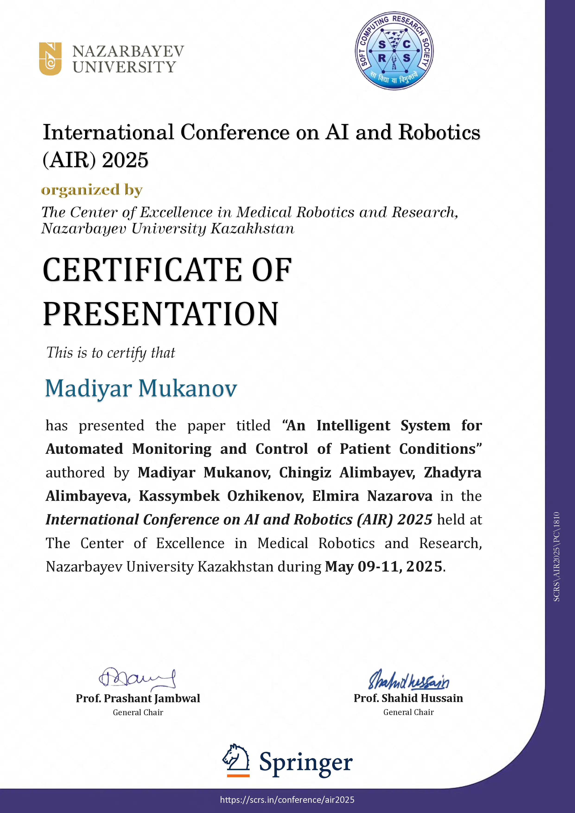

# An Intelligent System for Automated Monitoring and Control of Patient Conditions

Real-time **IR–RGB fusion** for contactless temperature screening with **face identification**, on-device logging (**SQLite**), alerts, and compact 3D-printed enclosure. *(Springer publication: **in press, 2025**).*

## Highlights
- Parallel capture: **MLX90640 (IR)** + **Pi Camera 2 (RGB)** → aligned ROI → estimation & thresholds.
- **Face ID** module for per-patient tracking; local logs, CSV export.
- Runs on **Raspberry Pi 4**, total HW cost **< $130** (BOM pending).

Minimal on-device pipeline. Pi Camera 2 and MLX90640 watch the patient’s face in parallel and stream into a Raspberry Pi 4. We timestamp and sync frames. 
All while logging {username, temperature_c, record_time, abnormality_notification} to SQLite for later poking around. Runs fully on-device (no cloud, no drama) for privacy and low latency.

<p align="center">
  
</p>
<p align="center">
  <a href="docs/figs/fig1_system_architecture.png">Open full-size figure →</a>
</p>

## Installation

We keep dependencies **strictly** to what the two demo scripts import.

```bash
# Python deps used only by the two demos
pip install -r requirements.txt

# System package required by the OpenCV demo
sudo apt update && sudo apt install -y python3-picamera2
```
## Demo

## 1) IR-only heatmap viewer (Matplotlib)
python examples/matplotlib_thermal_viewer.py

## 2) IR+RGB overlay with blend trackbar (OpenCV)
python examples/opencv_thermal_overlay.py 

## Hardware

**Physical hardware layout (RPi 4 + MLX90640 + Pi Camera 2 + HDMI IPS).** A **Raspberry Pi 4** provides on-device compute and I/O. The **Pi Camera 2** connects for the RGB stream, the **MLX90640** thermal array is attached on **I²C** (SDA=GPIO2, SCL=GPIO3) and powered at **3.3 V** (do not apply 5 V to the sensor). 

The video is rendered to an **IPS LCD** over HDMI. 

The system is supplied from a regulated **5 V** Li-ion source (≈5–7 W under load) with a single common ground. 

All processing runs locally, however cloud computing is used when AI is needed to improve the quality of thermal images.

Physical hardware layout (RPi4 + MLX90640 + Pi Camera 2):

<p align="center">  </p>

## Results

The RGB stream from Pi Camera 2 provides the face box and identity. 

Result example (face recognition + temperature annotation):

<p align="center">  </p>

## Evaluation

Paired RGB and MLX90640 frames were captured indoors with ambient temperature 16 °C.

As the subject moves away, each IR pixel integrates a larger portion of background, so the measured temperature decreases due to spatial averaging: ≈ 32.0 °C at 50 cm → ≈ 29.5 °C at 100 cm → ≈ 25.9 °C at 150 cm. Face-ID stays stable, but variance grows with distance. This illustrates the resolution limit of low-res thermal arrays and motivates recommended operating ranges (~0.6–0.8 m) or higher-resolution optics/compensation when accurate forehead estimation is required.

<p align="center">  </p>

**Ambient conditions (16 °C, 24 °C, 26 °C) and MLX90640 error.** Bars show the mean absolute error of the forehead temperature. As ambient temperature increases, error decreases—≈3.0 °C at 16 °C → ≈2.0 °C at 24 °C → ≈1.0 °C at 26 °C—because colder rooms amplify convective cooling of skin. 

In practice, operate near room temperature (≈24–26 °C).
<p align="center">  </p>

## Data Logging (SQLite)

Measurements are stored locally for analysis.

Each accepted reading produces one row with an auto-increment **id**, **username**, the estimated forehead **temperature** in °C, **record_time** timestamp, and an **abnormality_notification** label derived from thresholds (e.g., *Below Normal*, *Normal Range*, *Above Normal / Fever*).


<p align="center">  </p>

## Notes

If you use it in medical purpose, please be sure that you anonymize all data.

## Presentation & Proceedings

<p align="center">
  <kbd>Talk: AIR 2025</kbd> <kbd>SCRS × Nazarbayev University</kbd> <kbd>Springer LNNS (Scopus)</kbd>
</p>

**AIR 2025 — Artificial Intelligence and Robotics.**  
I presented this work under the auspices of **SCRS** and **Nazarbayev University**.  
Program schedule: [AIR 2025 Program](https://scrs.in/conference/air2025/page/AIR_2025%20Program%20Schedule)

**Proceedings.**  
The after-conference proceedings are planned to be published in the SCOPUS-indexed Springer book series **Lecture Notes in Networks and Systems (LNNS)**. The repository will be updated with the final bibliographic entry and DOI once available.

## Venue

- **International Conference on AI and Robotics (AIR) 2025**, Nazarbayev University  
  *Certificate of Presentation* — “An Intelligent System for Automated Monitoring and Control of Patient Conditions”  
  **Dates:** May 09–11, 2025 • **Organizers:** Center of Excellence in Medical Robotics and Research

<p align="center">
  
</p>
<p align="center">
  <a href="docs/awards/air2025_certificate.webp">Open full-size figure →</a>
</p>

[](#presentations--venue)

